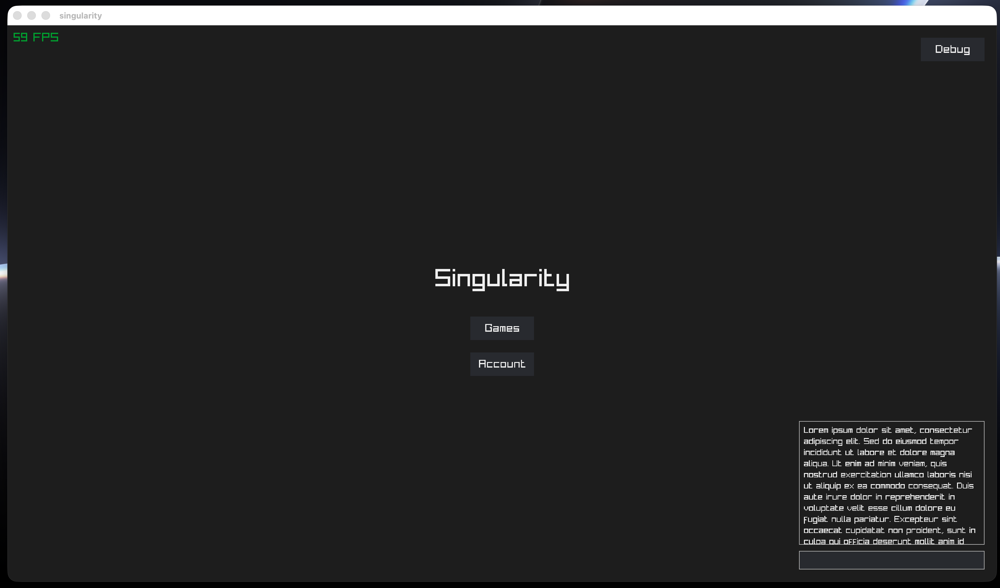
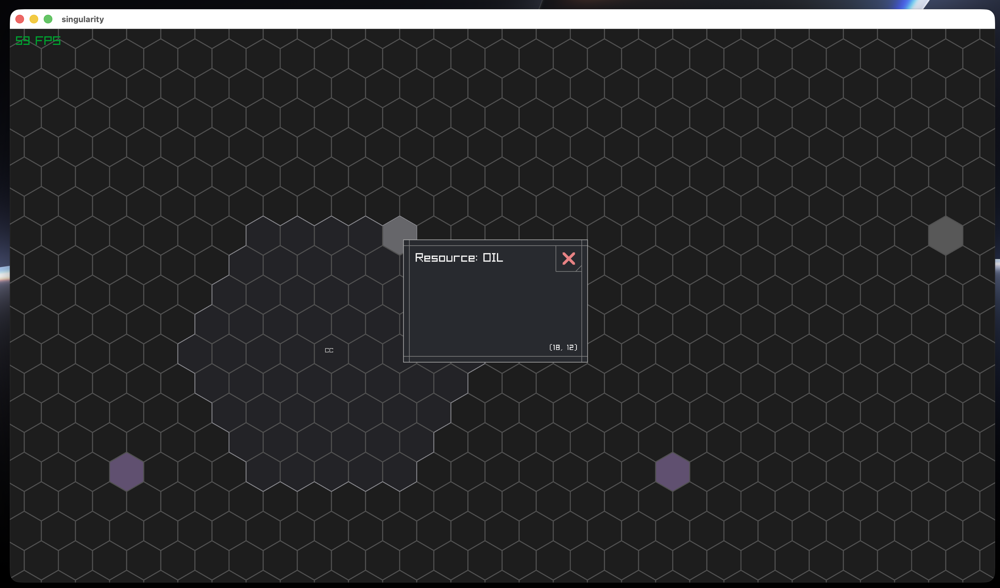
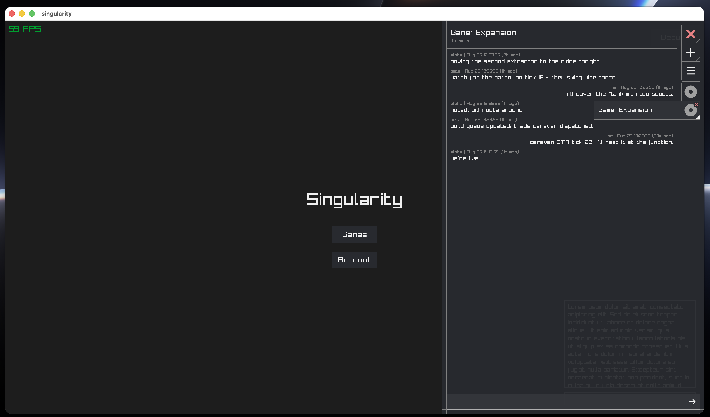

# Singularity

_A game of production and diplomacy_

This game is designed to facilitate organic, complex social interactions between players as each vies for supremacy over the others. Taking inspiration from [Subterfuge](http://subterfuge-game.com/), though the game occurs in "real time", the rate of time progression is slow enough to allow strategies and alliances to develop over the course of days or weeks. Players may tactically engage opponents in violent conflict, but they must also carefully develop resources and chains. This element of the game utilizes factory-building mechanics to allow players to specialize production to suit their specific geographic, social, or military needs. Thus, the realms of military and economy are blurred, fortifying bonds between players and intensifying every decision.

<details>
<summary>Screenshots</summary>

The title stage, with the FPS counter and debug controls:



The hex map with a tile detail panel:



The conversation panel:



</details>

## Local development

You must have Rust and Cargo installed on your machine.

Run the setup script:
```shell
./setup.sh
```

Start the database:
```shell
podman compose up -d
```

Run the database migrations:
```shell
./dbmate.sh up
```

Start the lobby server:
```shell
cargo run -p lobby
```

Start the live server (for in-game realtime communications):
```shell
cargo run -p live
```

Start the client:
```shell
cargo run -p client
```
